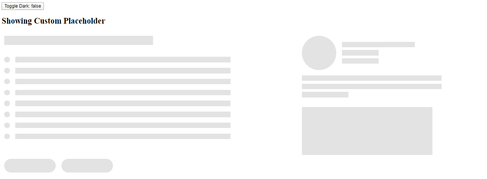
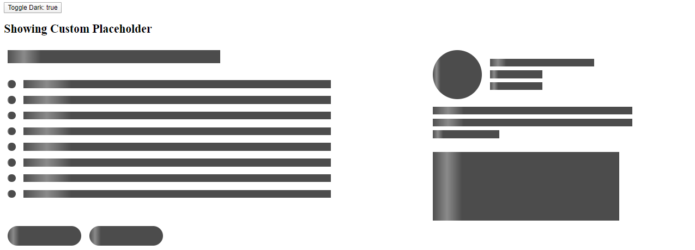

# NgxLoadingSkeleton Example App

## Running the example

```bash
npm start
```

Open another tab:

```bash
npm run dev
```

Open `localhost:4202` to check the exmaple.


## Example




## Full Docs

Check here for the full [documentation](./projects/loading-skeleton/README.md)


